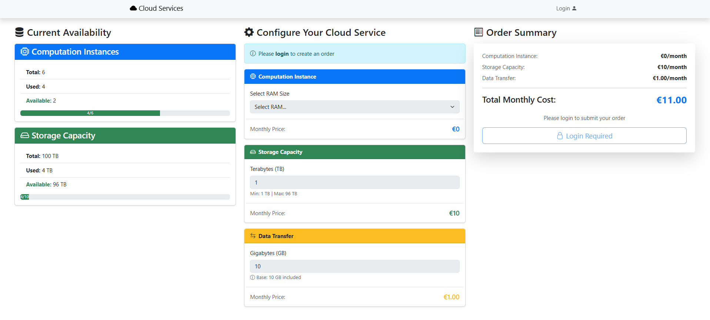
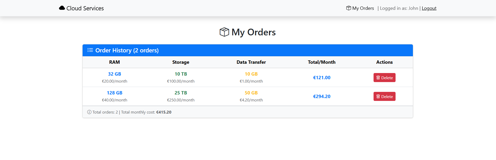
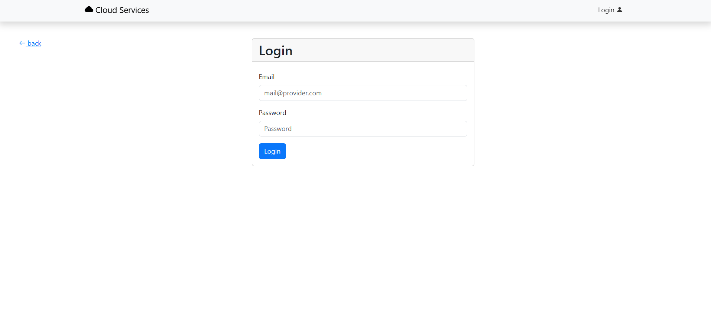

[](https://classroom.github.com/a/oNTPigDw)

# Exam #4: "Cloud"  
## Student: s331888 Bobò Andrea 

## React Client Application Routes

- Route `/`: Home page, configure your cloud service section, current resources availability, order summary, anybody can access it. Logges in users can also make orders.
- Route `/login`: Login form, allows users to login. After a successful login, the user is redirected to the main route ("/") or to ("/login-totp") if he is allowed to perform TOTP authentication. 
- Route `/login-totp`: TOTP verification page, accessible only after password login for users with 2FA enabled. Allows entering the 6-digit code to complete authentication.The user can choose to skip or to perform TOTP but in any case is redirect to ("/").
- Route `/orders`: Displays the list of past orders for the logged-in user. Shows order details (RAM, storage, data transfer, prices) and allows deletion of orders (only for users authenticated with TOTP).
- Route `*`: Page for nonexisting URLs (_Not Found_ page) that redirects to the home page.

## API Server
* **GET `/api/configuration`**: request configuration parameters for the cloud service (prices, limits, ecc.).
  - **Response body**: JSON object with ist of configuration parameters or description of the error(s):
  ```json

  {"price_ram_16":10,"price_ram_32":20,"price_ram_128":40,"price_storage_tb":10,"transfer_base_gb":10,"price_transfer_base":1,"transfer_discount_1":0.8,"transfer_discount_2":0.5,"transfer_threshold_1":1000,"max_instances":6,"max_storage_tb":100,"min_storage_ram_32":10,"min_storage_ram_128":20}

  ...

  - Codes: `200 OK`, `500 Internal Server Error`.

* **GET `/api/availability`**: request currently resources available.
  - **Response body**: JSON object with available resources specifying total, used and still available or description of the error(s): 
  ```json

  {"instances":{"total":6,"used":4,"available":2},"storage":{"total":100,"used":46,"available":54}}

  ```

  - Codes: `200 OK`, `500 Internal Server Error`.

  
  * **POST `/api/orders`**: create a new cloud resource order for the logged in user.
  - **Request**: JSON object with _ram_gb_ (integer: 16, 32, or 128), _storage_tb_ (integer, minimum 1), _data_transfer_gb_ (integer, minimum 10), _ram_price_ (number, positive), _storage_price_ (number, positive), _transfer_price_ (number, positive), and _price_per_month_ (number, positive):
    ```json
    { "ram_gb": 32,
      "storage_tb": 10,
      "data_transfer_gb": 500,
      "ram_price": 20.00,
      "storage_price": 100.00,
      "transfer_price": 0.50,
      "price_per_month": 120.50 }
    ```
  - **Response body**: JSON object with the created order on success, or description of the error(s):
    ```json
    { "id": 1,
      "user_id": 5,
      "ram_gb": 32,
      "storage_tb": 10,
      "data_transfer_gb": 500,
      "ram_price": 20.00,
      "storage_price": 100.00,
      "transfer_price": 0.50,
      "price_per_month": 120.50 }
    ```
    On error:
   ```json
    { "errors": [ "No computation instances available" ] }

    { "errors": [ "Not enough storage available" ] }

    { "errors": [ "32 GB RAM requires at least 3 TB storage" ] }

    ```
  - **Codes**: `201 Created`, `401 Unauthorized`, `400 Bad Request` (invalid request body or resource constraints), `500 Internal Server Error`.


  - * **GET`/api/orders`**: get all the orders for the logged-in user.
   - **Response body**: JSON object with array of order object or or description of the error(s):

 ```json

      { "id": 1,
        "user_id": 5,
        "ram_gb": 32,
        "storage_tb": 10,
        "data_transfer_gb": 500,
        "ram_price": 20.00,
        "storage_price": 100.00,
        "transfer_price": 0.50,
        "price_per_month": 120.50 }

   ```
  - **Codes**: `200 OK`, `401 Unauthorized`, `500 Internal Server Error`.


* **DELETE `/api/orders/:id`**: delete a specific order given the ID (requires TOTP authentication):
  - **Response body**: Empty on success, otherwise a JSON object with the error.
  - Codes: `200 OK`, `401 Unauthorized`, `500 Internal Server Error`.


### Authentication APIs

* **POST `/api/sessions`**: Authenticate and login the user.
  - **Request**: JSON object with credentials:   
    ```json
    { "username": "u1@p.it", "password": "password" }
    ```
  - **Response body**: JSON object with user info:   
    ```json
    { 
      "email": "a@p.it", 
      "name": "John",
      "canDoTotp": true,
      "isTotp": false
    }
     ```
  - **Codes**: `200 OK`, `401 Unauthorized` (incorrect email and/or password), `400 Bad Request` (invalid request body).
  

* **DELETE `/api/sessions`**: Logout the user.
  - Codes: `200 OK`, `401 Unauthorized`.


* **GET `/api/sessions/current`**: Get info on the logged in user.
  - **Response body**: JSON object with user info:   
    ```json
    { 
      "email": "a@p.it", 
      "name": "Luigi Verdi",
      "canDoTotp": true,
      "isTotp": false
    }
    ```
  - Codes: `200 OK`, `401 Unauthorized` (not authenticated).


* **POST `/api/login-totp`**: Perform the 2FA through TOTP.
  - **Request**: JSON object with the _code_:   
    ```
    { "code": "123456" }
    ```
  - **Response body**: fixed JSON object in case of success
  - Codes: `200 OK`, `401 Unauthorized` (incorrect code).


## Database Tables

- Table `users` - _autogenerated_id_, _name_, _email_,  _hash_, _salt_,  _secret_.

- Table `configuration`: _key_, _value_, _description_.
  Stores system configuration parameters as key-value pairs (e.g., max_instances, max_storage_tb, min_storage_ram_32, min_storage_ram_128).

- Table `orders`: _id_, _user_id_, _ram_gb_, _storage_tb_, _data_transfer_gb_, _ram_price_, _storage_price_, _transfer_price_, _price_per_month_.
  _user_id_: references the user who placed the order;
  _ram_gb_: must be 16, 32, or 128.


## Main React Components

- `App` (in `App.js`): App in App.jsx is the root component that manages user authentication state and defines the application's routing (home, login, TOTP verification, orders, 404).
- `CloudConfiguration` (in `CloudConfiguration.jsx`): is a form component that allows users to configure cloud service parameters (RAM instance, storage capacity, data transfer) and displays corresponding prices.
-  `CurrentAvailability ` (in `CurrentAvailability.jsx `): displays the current availability of computation instances and storage capacity using progress bars and visual indicators.
-  `HomePage` (in `HomePage.jsx`): is the main page component that loads cloud configuration/availability data from the server and orchestrates the CloudConfiguration, CurrentAvailability, and OrderSummary components for ordering cloud services.
- `LoginForm` (in `LoginForm.js`): the login form that students can use to login into the app. This is responsible for the client-side validation of the login credentials (valid email and non-empty password).
- `OrderList` (`in OrderList.jsx`): fetches and displays the logged-in user's past orders in a table, with the ability to delete orders (if TOTP-authenticated).
- `OrderSummary` in (`OrderSummary.jsx`): displays the order total breakdown (instance, storage, data transfer prices) and provides a submit button to confirm the cloud service order.


## Screenshot





## Users Credentials

| email | password | name | 2FA (TOTP) |
|-------|----------|------|------------|
| u1@p.it | password | John | Yes |
| u2@p.it | password | Alice | Yes |
| u3@p.it | password | George | No |
| u4@p.it | password | Max | No |

